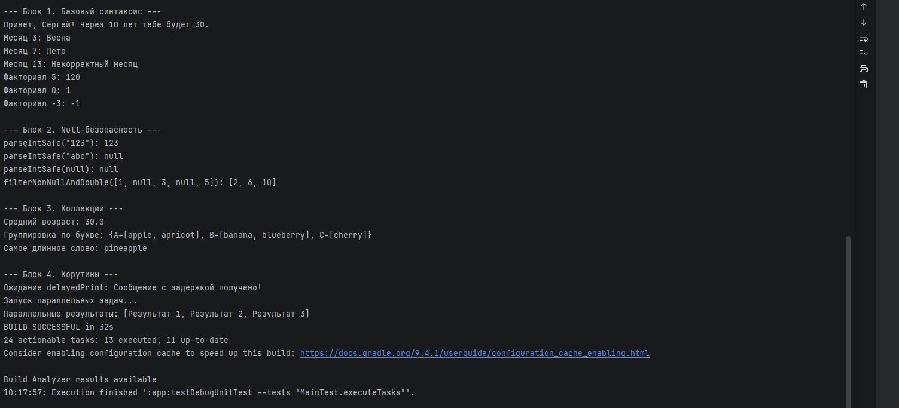

<div align="center">

# Kotlin Tasks
### Программирование мобильных устройств · Лабораторная работа №2

Базовый синтаксис · Null Safety · Коллекции · Корутины

10 основных задач на Kotlin и проверки ожидаемых результатов.

[Паспорт](#passport) · [Задачи](#tasks) · [Запуск](#run) · [Результат](#result) · [Отчёт и вопросы](REPORT.md)

</div>

---

<a id="passport"></a>
## Программирование мобильных устройств — паспорт

| Поле | Значение |
|:---|:---|
| Университет | Северо-Кавказский федеральный университет |
| Дисциплина | Программирование мобильных устройств |
| Лабораторная работа | №2 — Основы языка Kotlin. Решение задач |
| Студент | Иванников Сергей Сергеевич |
| Группа | ПИН-б-о-24-1 |
| Подгруппа | 2 |
| Преподаватель | Щеголев Алексей Алексеевич |
| Дата | 06.10.2026 |

<a id="tasks"></a>
## Программирование мобильных устройств — задачи

| № | Функция | Назначение |
|:---|:---|:---|
| 1.1 | `greetUser` | Приветствие и возраст через 10 лет |
| 1.2 | `getSeason` | Время года по номеру месяца через `when` |
| 1.3 | `factorial` | Факториал с хвостовой рекурсией |
| 2.1 | `parseIntSafe` | Безопасное преобразование строки в число |
| 2.2 | `filterNonNullAndDouble` | Удаление `null` и удвоение чисел |
| 3.1 | `averageAge` | Средний возраст, включая пустой список |
| 3.2 | `groupByFirstLetter` | Группировка слов по заглавной первой букве |
| 3.3 | `findLongestWord` | Самое длинное слово или `null` |
| 4.1 | `delayedPrint` | Сообщение → задержка → «Готово!» |
| 4.2 | `runParallelTasks` | Три задачи с задержками 1, 2 и 3 секунды; вывод по завершению |

Дополнительное задание `processUserInput` в текущую реализацию не входит.

## Программирование мобильных устройств — стек

| Компонент | Конфигурация проекта |
|:---|:---|
| Язык | Kotlin |
| Структура сборки | Android-модуль `app`, Gradle Kotlin DSL |
| Android Gradle Plugin | 9.2.1 |
| Gradle Wrapper | 9.4.1 |
| JVM toolchain | 21 |
| Корутины | `kotlinx-coroutines-core:1.8.0` |
| Проверки | JUnit 4.13.2 |
| SDK | min 24, target 37, compile 37 с minor API level 1 |

Задачи выполняются в JVM через локальный тестовый раннер. В манифесте нет стартовой Activity: запуск Android-приложения на эмуляторе для этой работы не используется.

<a id="run"></a>
## Программирование мобильных устройств — запуск

```bash
git clone https://github.com/akkariq/kotlin-tasks.git
cd kotlin-tasks
```

Откройте корневую папку в Android Studio, дождитесь синхронизации Gradle и установки SDK-компонентов, указанных в `app/build.gradle.kts`. Проект использует JVM toolchain 21.

Для демонстрации откройте `app/src/test/java/MainTest.kt` и запустите `executeTasks` кнопкой возле теста. Вывод `main()` появится в окне результатов.

### Windows PowerShell

Демонстрация с консольным выводом:

```powershell
.\gradlew.bat :app:testDebugUnitTest --tests "MainTest" --info
```

Проверки результатов задач:

```powershell
.\gradlew.bat :app:testDebugUnitTest --tests "ru.ivannikov.tasks.TasksTest"
```

### Linux / macOS

```bash
chmod +x gradlew
./gradlew :app:testDebugUnitTest --tests "MainTest" --info
./gradlew :app:testDebugUnitTest --tests "ru.ivannikov.tasks.TasksTest"
```

HTML-отчёт после выполнения локальных тестов: `app/build/reports/tests/testDebugUnitTest/index.html`.

## Программирование мобильных устройств — проверки

`MainTest` запускает демонстрацию. `TasksTest` содержит 10 тестовых методов с проверками строк, границ месяцев, факториала, nullable-значений, коллекций и корутин. Наличие тестов не означает, что они уже успешно выполнены: после этих изменений запуск тестов здесь не выполнялся.

<a id="result"></a>
## Программирование мобильных устройств — результат

<div align="center">

</div>

Сохранённый скриншот демонстрационного запуска. Точные ожидаемые значения для текущей реализации зафиксированы в `TasksTest`.

## Программирование мобильных устройств — структура

```text
kotlin-tasks/
├── app/
│   ├── build.gradle.kts
│   └── src/
│       ├── main/java/
│       │   ├── Main.kt
│       │   └── ru/ivannikov/tasks/
│       │       ├── BasicSyntax.kt
│       │       ├── NullSafety.kt
│       │       ├── Collections.kt
│       │       ├── Coroutines.kt
│       │       └── DataClasses.kt
│       └── test/java/
│           ├── MainTest.kt
│           └── ru/ivannikov/tasks/TasksTest.kt
├── gradle/
├── screenshots/console_output.png
├── README.md
├── REPORT.md
├── gradlew
└── gradlew.bat
```

## Программирование мобильных устройств — материалы

- [Точка входа](app/src/main/java/Main.kt)
- [Файлы задач](app/src/main/java/ru/ivannikov/tasks)
- [Тесты с проверками](app/src/test/java/ru/ivannikov/tasks/TasksTest.kt)
- [Отчёт и 10 контрольных вопросов](REPORT.md#questions)

---

Иванников Сергей Сергеевич · ПИН-б-о-24-1 · 2026
